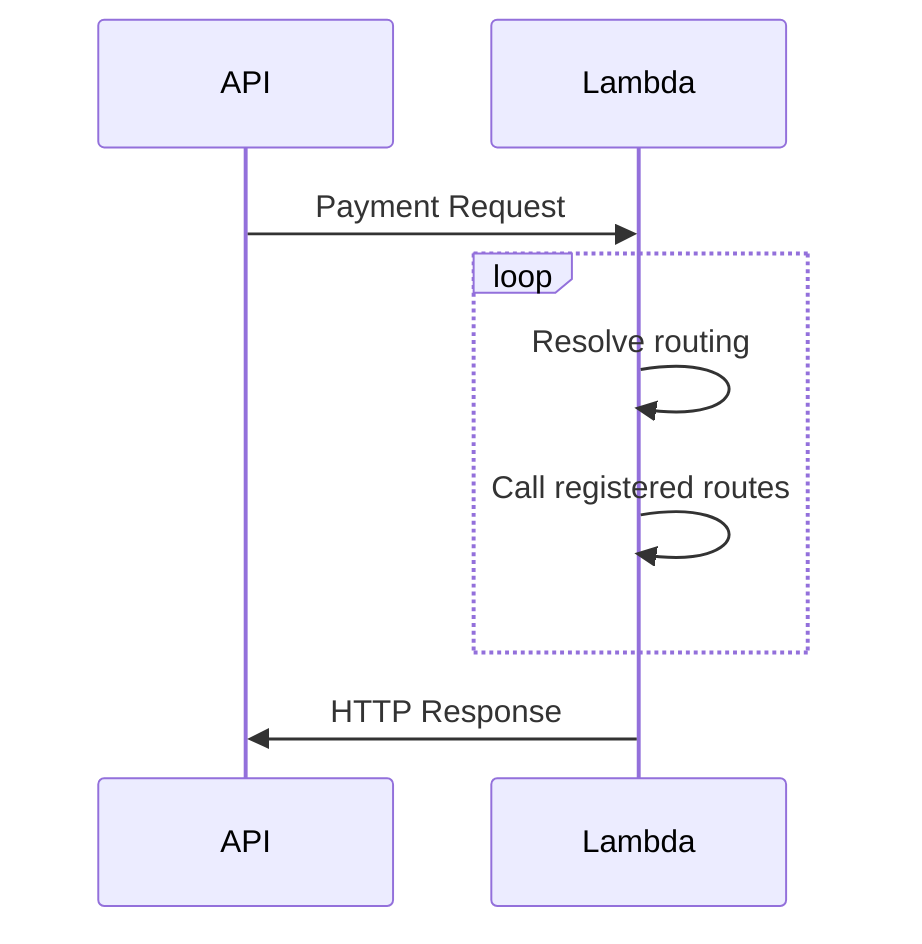

!!! info "This is an educational sample created in a live coding setting"

## Install

You can install all development dependencies using: `make dev`

You can also visualize this documentation via `make docs`

!!! tip "Try adding docstrings for functions and see the API docs being auto-generated"

## Fast prototyping

!!! tip "Use this for Sandbox environments"

SAM CLI supports fast deployment of functions and infrastructure that changes: `make watch`, `make logs`, and optionally `make traces`

## Data flow

## Agenda

> Sample agenda

### Intro

* AWS Well-Architected Serverless Lens
* Why Lambda Powertools

## Agenda

### Intro

* [AWS Well-Architected Serverless Lens](https://aws.amazon.com/blogs/aws/new-serverless-lens-in-aws-well-architected-tool/)
* Why Lambda Powertools
* Powertools for [Java](https://awslabs.github.io/aws-lambda-powertools-java/), [TypeScript](https://awslabs.github.io/aws-lambda-powertools-typescript/latest/), and [Python](https://awslabs.github.io/aws-lambda-powertools-python/latest/) (soon .NET too)

!!! question "Golang dev?"
  We'd love to hear feedback on whether we should publish a Powertools for Go

  Reach out: aws-lambda-powertools-feedback@amazon.com

### API example

* **Intro to Core utilities**

### Batch Processing example

* **Idea**
    - [Visualize the use case](https://mermaid-js.github.io/mermaid-live-editor/)
    - Policy request JSON sample
    - PII data we need to scrub
        - `Policy.oldest_driver_dob`
        - `Policy.youngest_driver_dob`
        - Everything in `Policy.policyholder`
* **Project structure**
    - Batch Infra requirement
    - Resource Mapping (integ/e2e test setup)
* **First dummy batch processing**
    - Powertools Batch
    - Partial failure example
* **Data modelling**
    - [Lightning Pydantic 101](https://pydantic-docs.helpmanual.io/)
    - [JSON to Pydantic](https://jsontopydantic.com/) tool
    - Powertools Batch Pydantic integration
* **Data scrubbing**
    - Pydantic [data validators](https://pydantic-docs.helpmanual.io/usage/validators/)
    - Dummy data redactor
* **Idempotency**
    - Batch integration

## Ideas

Some ideas to extend this sample project created at the Meetup for your learning purposes:

* Use [Tracer annotations](https://awslabs.github.io/aws-lambda-powertools-python/latest/core/tracer/#annotations-metadata) to capture business info in traces
* Handle [HTTP 404](https://awslabs.github.io/aws-lambda-powertools-python/latest/core/event_handler/api_gateway/#handling-not-found-routes) and [any custom exception](https://awslabs.github.io/aws-lambda-powertools-python/latest/core/event_handler/api_gateway/#exception-handling) you might want
* [Split routes in separate files](https://awslabs.github.io/aws-lambda-powertools-python/latest/core/event_handler/api_gateway/#split-routes-with-router)
* Use [HTTP Bin](http://httpbin.org/#/) to experiment with tracing outgoing requests/responses
* [Create your own middleware](https://awslabs.github.io/aws-lambda-powertools-python/latest/utilities/middleware_factory/) for before/after requests including a set of Powertools features in a single-all-in-one-conquer-all decorator -- for example, authorization, data redacting, etc.
* Extend the architecture [diagram with code](https://diagrams.mingrammer.com/) - `architecture.py`

## Useful resources

* [Useful and related productivity CLIs](https://github.com/ljacobsson/awesome-lars-tools)
* [SAM Accelerate to speed up development](https://docs.aws.amazon.com/serverless-application-model/latest/developerguide/accelerate.html)
* [MermaidJS Web Editor](https://mermaid-js.github.io/mermaid-live-editor/)
* **Lambda Powertools specifics**
  * [Tutorial for first time customers](https://awslabs.github.io/aws-lambda-powertools-python/latest/tutorial/)
  * **[Event Handler - REST](https://awslabs.github.io/aws-lambda-powertools-python/latest/core/event_handler/api_gateway/)**
    * [Routing API Gateway REST API requests with ease](https://awslabs.github.io/aws-lambda-powertools-python/latest/core/event_handler/api_gateway/#api-gateway-rest-api)
    * [Accessing incoming request details](https://awslabs.github.io/aws-lambda-powertools-python/latest/core/event_handler/api_gateway/#accessing-request-details) e.g., query strings, payload, etc.
  * **[Tracer](https://awslabs.github.io/aws-lambda-powertools-python/latest/core/tracer/)**
    * [Tracing Lambda handler](https://awslabs.github.io/aws-lambda-powertools-python/latest/core/tracer/#lambda-handler)
    * [Tracing any Python function](https://awslabs.github.io/aws-lambda-powertools-python/latest/core/tracer/#synchronous-functions)
  * **[Logger](https://awslabs.github.io/aws-lambda-powertools-python/latest/core/logger/)**
    * [Injecting Lambda context in structured logging](https://awslabs.github.io/aws-lambda-powertools-python/latest/core/logger/#capturing-lambda-context-info)
    * [Setting correlation ID](https://awslabs.github.io/aws-lambda-powertools-python/latest/core/logger/#setting-a-correlation-id)
    * [Popular correlation IDs](https://awslabs.github.io/aws-lambda-powertools-python/latest/core/logger/#built-in-correlation-id-expressions)
  * **[Metrics](https://awslabs.github.io/aws-lambda-powertools-python/latest/core/metrics/)**
    * [Creating your first metric](https://awslabs.github.io/aws-lambda-powertools-python/latest/core/metrics/#creating-metrics)
    * [Capturing cold start as a metric](https://awslabs.github.io/aws-lambda-powertools-python/latest/core/metrics/#capturing-cold-start-metric)
  * **[Batch processing](https://awslabs.github.io/aws-lambda-powertools-python/latest/utilities/batch/)**
    * [Partial failure handling with SQS](https://awslabs.github.io/aws-lambda-powertools-python/latest/utilities/batch/#processing-messages-from-sqs)
    * [Integration with Pydantic for deep data validation](https://awslabs.github.io/aws-lambda-powertools-python/latest/utilities/batch/#pydantic-integration)
  * **[Idempotency](https://awslabs.github.io/aws-lambda-powertools-python/latest/utilities/idempotency/)**
    * [Idempotency sequence diagram](https://awslabs.github.io/aws-lambda-powertools-python/latest/utilities/idempotency/#idempotency-request-flow)
    * [`idempotency_function` decorator for any Python function](https://awslabs.github.io/aws-lambda-powertools-python/latest/utilities/idempotency/#idempotent_function-decorator)
    * [Choosing idempotency key from one or more JSON fields](https://awslabs.github.io/aws-lambda-powertools-python/latest/utilities/idempotency/#choosing-a-payload-subset-for-idempotency)
  * **[Parameters](https://awslabs.github.io/aws-lambda-powertools-python/latest/utilities/parameters/)**
    * [Fetching parameters from EC2 System Manager Parameter Store](https://awslabs.github.io/aws-lambda-powertools-python/latest/utilities/parameters/#fetching-parameters) (used in E2E test fixtures example)
  * **[JMESPath Powertools functions](https://awslabs.github.io/aws-lambda-powertools-python/latest/utilities/jmespath_functions/)**
    * [`powertools_json`](https://awslabs.github.io/aws-lambda-powertools-python/latest/utilities/jmespath_functions/#powertools_json-function) to deserialize JSON strings into JSON while extracting data
* **VSCode Extensions**
    - [Serverless IDE](https://marketplace.visualstudio.com/items?itemName=ThreadHeap.serverless-ide-vscode) - auto-complete CloudFormation resources and docs
    - [IAM Legend](https://marketplace.visualstudio.com/items?itemName=SebastianBille.iam-legend) - auto-complete IAM actions
    - [Mermaid Editor](https://marketplace.visualstudio.com/items?itemName=bierner.markdown-mermaid)
    - [UUID Generator](https://marketplace.visualstudio.com/items?itemName=netcorext.uuid-generator)
    - [Markdown All In One](https://marketplace.visualstudio.com/items?itemName=yzhang.markdown-all-in-one)****
* **Browser tools**
  * [Tree code view in GitHub](https://www.octotree.io/)
  * [Optimized GitHub view for OSS Maintainers](https://github.com/sindresorhus/refined-github)

### Not covered but might be useful

* **Code quality**
  * **[Git pre-commit framework](https://pre-commit.com)**
    * Config available at `.pre-commit-config.yaml`
    * [Quick list of plugins available](https://pre-commit.com/hooks.html) (almost any language)
  * [CloudFormation Linter](https://github.com/aws-cloudformation/cfn-lint)
  * [Several commonly used code quality](https://realpython.com/python-code-quality/) tools in Python
  * [Security linter](https://github.com/PyCQA/bandit)
  * [Code complexity baseline](https://radon.readthedocs.io/en/latest/intro.html)
  * [Static type checker (Mypy)](https://mypy.readthedocs.io/en/stable/)
  * All of these tools and more are used in `make pr`
* **KMS and Encryption related**
    - [AWS Encryption SDK and Envelope Encryption 101](https://medium.com/cyberark-engineering/aws-encryption-sdk-in-baby-steps-a2a5a99cea24)
    - [Data Encryption Key caching (DEK) practice](https://docs.aws.amazon.com/encryption-sdk/latest/developer-guide/data-key-caching.html)
    - [Demystifying KMS encryption operations in AWS](https://aws.amazon.com/blogs/security/demystifying-kms-keys-operations-bring-your-own-key-byok-custom-key-store-and-ciphertext-portability/)
* **Shared in informal chat after presentation**
  * Interface Definition Language for APIs: https://awslabs.github.io/smithy/
  * Build system framework for monorepos & microrepos: https://www.pantsbuild.org/
    * From the chat on how you can test only source code that has changed, etc.
